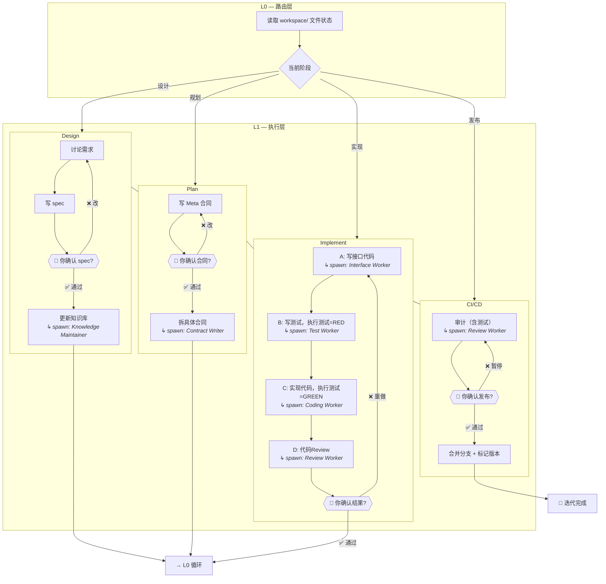

# Project-Pilot

**基于多 agent 协作的理念**，为 [Openclaw](https://openclaw.ai) 打造的 **轻量级项目开发 skill**。

你的想法将通过一个结构化的开发生命周期——设计、规划、实现、发布——落地为可运行、可迭代的项目。整个生命周期中，多个专职 agent 分工协作，而你始终掌控全局。

### 是什么

- 一个**调度框架**：协调大量 subagent 完成完整开发周期 ↔ 默认状态下一个 agent 写完所有修改
- 一个**文件驱动的状态机**：项目状态基于文件系统，跨会话不丢失 ↔ 默认状态下只能靠读日志来恢复上下文
- 一个**文档先行的工作流**：spec → 合同 → 代码，每一步都经过 review ↔ 默认状态下没有一致性控制
- 一个**项目知识库**：实时反应代码库设计 ↔ 默认状态下 agent 只能读代码来了解项目

### 不是什么

- 不是存粹的编码 agent——工程化、结构化是本项目的核心，而非编码能力本身
- 不是自治系统——每个关键节点都需要人类确认
- 不是团队工具——为单人与 openclaw 协作而设计

---

## 安装

> 强烈推荐直接将项目 url 发给 Openclaw，让 claw 来帮你安装。

### 前置条件

- OpenClaw gateway 已运行
- 至少一个模型可用（推荐使用 `deepseek-v4-flash` 或 `qwen3.5-plus`）

### 步骤 1：安装 skill

```bash
# 克隆到 OpenClaw skills 目录
git clone <repo-url> <your_openclaw_dir>/skills/project-pilot
```

### 步骤 2：注册 skill 与 agent

将 `project-pilot/openclaw.json` 配置合并到你的 Openclaw 配置中。

> 请根据实际的 project-pilot 目录路径调整各 agent 的 `workspace` 路径。

### 步骤 3：重启 gateway 并 reset 会话

```bash
openclaw gateway restart # 或者交由用户执行
```

> 较新版本的 Openclaw 能够热更新配置变动，但仍需要 reset 会话。

---

## 工作流程

在任意对话中说 `使用 project-pilot 开发`。Project-pilot 会自动检测当前项目的生命周期阶段并开始工作。

1. **初始化**（仅首次）：claw 创建项目结构和 `PROJECT.AGENT.md` — **你确认**
2. **设计**：claw 跟你讨论需求，产出 spec 文档 — **你确认**，随后 claw 更新知识库
3. **规划**：claw 将 spec 拆解为具体任务（contracts）— **你确认**
4. **实现**：claw 逐个执行任务（接口 → 测试 → 代码 → review）— **你确认**
5. **发布**：claw 审计所有变更并提交 — **你确认**，随后 claw 合并分支、提交版本

每次迭代循环 2→5。说 `使用 project-pilot 开发` 开始，claw 自动检测当前阶段，从断点继续。

### 人类需要了解的必要内容

你可以完全不懂代码。Project-pilot 会通过自然语言和你沟通，你只需要做好三件事：

**1. 确认设计方向（最重要）**

当 claw 说"讨论完成，这是 spec，这样可以吗？"——你在确认的是："这个方案就是我想要的。"仔细读 spec，它有：
- 这次要实现什么功能
- 每个功能的大致行为描述
- 你不太认可的地方直接说，claw 会改

**2. 确认任务拆法（很轻量）**

Spec 确认后，claw 会把功能拆成几个任务（合同）。你只需要扫一眼：
- 任务数量对不对？（比如"用户登录"和"权限管理"是两件事，应该分开）
- 说的功能是不是 spec 里提过的？
- 太多了也可以说"这次先不做这个"

**3. 确认实现结果**

Claw 做完会给你一份**行为验证报告**，用自然语言描述每个功能的状态：

```
✓ 用户登录：可以用邮箱和密码登录
✓ 任务列表：可以查看、添加、修改任务
✗ 邮件通知：有 bug（见描述）
```

**你不用看代码**。如果报告说不清楚（比如只列了"修改了 user.ts: 15 行"），就告诉 claw"用我能看懂的话重写报告"。它应该告诉你功能做没做，而不是文件改了哪里。

**任何时候都可以说"不行"**

每个确认点，你说"不行"后 claw 会退回去调整或重新做。这不是故障，这是流程的正常部分。不满意就让它改。

---

**总结：你要做的 = 读描述 → 说可以/不行。代码的事交给 claw。**

### Bugfix 模式

遇到 bug 时可以跳过设计阶段，直接进入规划→实现→发布的快速路径。

---

## 架构概览



每个 agent 有独立的工作空间，位于 `agent-workspaces/`。设计决策和技术细节见 [ARCHITECTURE.md](docs/architecture.md)。

---

## 进一步阅读

以下文档面向想深入了解或定制 project-pilot 的读者：

- [架构设计](docs/architecture.md) — L0/L1/L2 协作模型、文件状态机、agent 间通信
- [知识库设计](docs/knowledge-base.md) — 三层体系（Knowledge/Spec/Contract）与导航规则
- [Spec 格式](docs/spec.md) — 迭代设计文档的结构和内容要求
- [Contract 格式](docs/contract.md) — 任务分解模板和 review 集成
- [内部约定](docs/conventions.md) — 路径规则、review gate、spawn 格式等
