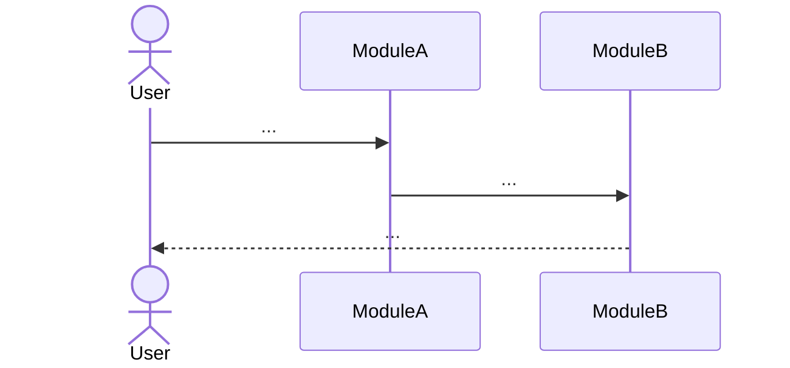

# Journey Format

A user journey describes what a user does and what the system does in response.

## Structure

```markdown
# {Journey Name}

## User Story

{As a role, I want capability, so that benefit.}

## Flow



## System Mapping

| Step | Module | Interface |
|------|--------|-----------|
| User action | {module} | `interface_name()` |
| System processes | {module} | `interface_name()` |

## Related Journeys

- {other journey}: {relationship}
```
