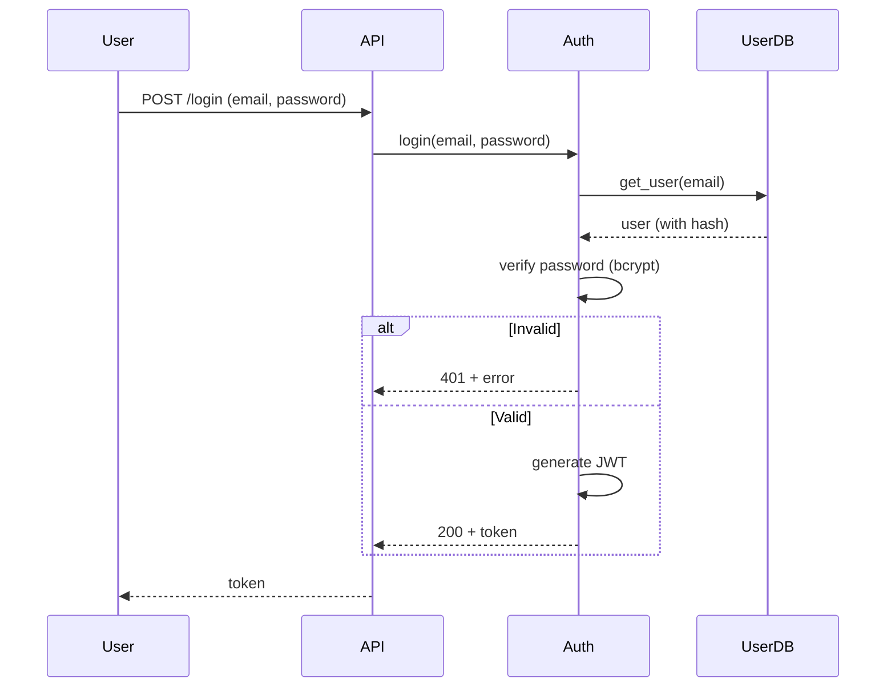

# Spec — Per-Iteration Design Document

> *The design document for one iteration: what changes and how to do it.*

---

## Core Principle

**Spec = Diff + Implementation Strategy.** It's iteration-specific, not a permanent system description.

| Document | Content | Lifespan | Written By |
|----------|---------|----------|------------|
| **Knowledge** | "What exists" + constraints | Permanent (updated per iteration) | Knowledge Maintainer |
| **Spec** | "How this iteration changes things" | Per-iteration (archived) | Design Agent |
| **Code** | Concrete implementation | Permanent (Git) | Coding Worker |

---

## Structure

```
docs/specs/YYYY-MM-DD-{feature-name}.md
```

Example: `docs/specs/2026-04-09-auth.md`

---

## Sections

### 1. PRD (Product Requirements)

**User stories** — the "what" from the user's perspective:

```markdown
## PRD

### User Stories
- As a user, I can log in with my email and password
- As a user, I can see a meaningful error message if login fails

### Acceptance Criteria
- [ ] Login with valid credentials returns a token within 2s
- [ ] Login with invalid credentials returns specific error
- [ ] Account lockout after 5 failed attempts

### Out of Scope
- OAuth login (separate feature)
- Password reset
```

Out of scope is critical. It prevents scope creep and keeps the iteration focused.

### 2. Implementation Strategy

**Technical decisions** — why this approach over others:

```markdown
## Implementation Strategy

### Technical Decisions
- **Authentication**: JWT (HS256, 2-hour expiry) — stateless, no session store needed
- **Password storage**: bcrypt with cost factor 12
- **Rate limiting**: Redis token blacklist (enables logout)

### Business Logic Topology



The topology flow is the **most important part of the Spec** — it's what enables white-box review. A reviewer (or the Review Worker) can read this flow and check if the code actually follows it.

### 3. Changes Summary

**Diff from current state — what files, what Knowledge, what interfaces:**

```markdown
## Changes Summary

### Modules Changed
- `auth`: Add `login()` method, password verification
- `session`: Add rate limiting (Redis)

### Interfaces Changed
- `interfaces/auth.md`: Add `login(credentials) -> token` method

### Knowledge Updated (Target State)
- `modules/auth.md`: Add login responsibility, password constraint
- `interfaces/auth.md`: Add login signature

### Not Changed (Explicit)
- User module (existing, no changes needed)
- OAuth flow (out of scope)
```

Explicit "Not Changed" prevents the Implement Agent from second-guessing.

### 4. Current State Summary

Brief context so the Implement Agent can understand the baseline without reading all of Knowledge:

```markdown
## Current State

The project has a User module (CRUD operations) and a Session module (token-based sessions).
No authentication exists yet — all endpoints are public.
```

1-2 paragraphs is enough. The full baseline is in Knowledge; this is just enough to orient.

---

## What Spec Does NOT Contain

| Content | Reason | Where It Goes |
|---------|--------|---------------|
| Full system description | Bloated, always outdated | Knowledge |
| Code-level implementation details | Will be in Code | Code |
| Stable constraints | Already in Knowledge | Knowledge |
| Test cases | TDD covers this | Tests |
| Commit messages | Determined during implementation | Git |

---

## Spec vs Knowledge Boundary (Cheatsheet)

| Question | Spec | Knowledge |
|----------|------|-----------|
| "What modules are involved?" | ✅ (this iteration) | ✅ (full system) |
| "What interfaces change?" | ✅ (diff) | ✅ (target state) |
| "What is the login flow?" | ✅ (OAuth flow this iteration) | ✅ (complete flow) |
| "Why use JWT?" | ✅ (design decision) | ❌ |
| "Timeout/retry settings?" | ✅ (parameters) | ❌ |
| "Auth cannot connect to DB directly?" | ❌ (stable constraint) | ✅ |
| "OAuth users cannot change password?" | ❌ (business rule) | ✅ |

---

## Review Gate

Spec is reviewed by the **Design Agent itself** using the Quality Checklist from `write-specs` skill (not a separate Review Worker — Spec has no upstream source to verify against).

| Defect | Meaning |
|--------|---------|
| **INCOMPLETE** | Required section missing or too vague |
| **AMBIGUOUS** | Can be interpreted in multiple ways |
| **INCONSISTENT** | Spec contradicts itself internally |

---

## Knowledge Ref Injection

After Knowledge Maintainer runs, it appends a `## Knowledge Ref` section to the Spec:

```markdown
## Knowledge Ref

**Created**:
- `docs/knowledge/interfaces/auth.md`

**Updated**:
- `docs/knowledge/modules/auth.md`
```

This feeds Plan Agent's contract anchor references and enables traceability.

---

## Lifecycle

```
Design Agent discusses with human
  → Writes Spec (PRD + Strategy + Changes + Current)
  → Human confirms
  → Knowledge Maintainer extracts Knowledge from Spec
  → Design Agent verifies (git diff -- docs/knowledge/)
  → Commits
```

Spec is archived in `docs/specs/` as a permanent record. Git history is the archive.
